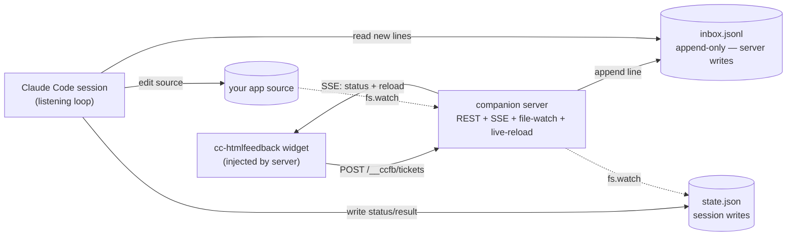

# cc-htmlfeedback — live Claude Code feedback loop

**Date:** 2026-05-24 (product requirements refined 2026-05-25)
**Status:** Approved design (pre-implementation); product requirements locked
**Topic:** Turn the in-page feedback tool into a live work queue that a Claude Code session drains — comment → fix → hot reload — with the sidebar acting as a todo/in-progress/done board.

---

## 1. Goal

Today cc-htmlfeedback is an *export* tool: highlight text, write a comment, copy structured feedback, paste it to Claude. This design removes the copy-paste. A submitted comment is sent to the **same Claude Code session** that launched the dev server; the session edits the app's source; the dev server **hot-reloads** the page; and each comment lives in the sidebar as a **ticket** that moves `todo → in-progress → done` automatically.

Success criteria:
- From a running app, a developer highlights an element, writes "make this button blue", submits, and within seconds the page reloads with the change and the ticket shows `done` — no copy-paste, no manual prompt.
- The loop runs inside the developer's existing Claude Code session, started by an explicit trigger.
- Fixes auto-apply; git is the undo path.

## 1a. Product requirements (v1) — solo dev, open-source

Audience and intent locked with the user (2026-05-25):

- **Audience: a solo developer on their own app.** No author identity, assignment, or multi-user/collaboration concepts. (Built to be published open-source, so: zero project-specific hardcoding, works on any local web app, easy setup, good docs.)
- **Fix scope: anything (full dev tasks).** A comment is treated as an arbitrary coding task — logic, data, new features, refactors — not just look-and-wording tweaks. This raises power and unpredictability, which is why verification (below) is mandatory.
- **Timing: immediate, one at a time.** Submitting a comment kicks off its fix right away; tickets are processed sequentially, not batched.
- **Refinement: leave a new comment.** There is no reply-threading or reopen-to-edit. If a fix is wrong, the user drops a fresh comment (a new ticket); the old ticket stays `done`. Keeps the model dead-simple.
- **Board: one shared list, full history, persistent.** Every ticket across every page appears in a single list, each labeled with its page. The board **persists across sessions** as a running log (done/closed tickets are kept, not cleared).
- **`done` means applied *and* verified.** Before flipping a ticket to `done`, the loop verifies the change actually works in the browser (Chrome). A change that doesn't verify stays `in-progress` or goes `error`.
- **Each `done` card shows a one-line "what changed" summary + the files touched** — a glance-able record, important because full-task fixes are less predictable than cosmetic ones.
- **Standalone copy-paste mode stays.** The Chrome extension (and bookmarklet/drop-in) keep working with no server — highlight, comment, **Copy feedback**. In that mode a dismissible banner advertises the live path: *ask Claude Code to run `/cc-htmlfeedback`*, with a one-click copy of that prompt. So the tool is useful immediately on install, and the interactive loop is an opt-in upgrade.

## 2. Two modes (one widget)

The widget gains a transport abstraction selected at load time:

- **Standalone mode** (existing, **retained**): extension / bookmarklet / drop-in. "Submit" → in-memory store + clipboard export. No statuses. This is the default whenever the widget is not connected to a companion server.
  - **Upsell banner:** standalone mode shows a small **closable info banner** — e.g. *"💡 Want Claude to fix these live instead of copy-pasting? Ask Claude Code to run `/cc-htmlfeedback`."* — with a **copy-prompt icon** that copies a ready-to-paste prompt/command for the user's Claude Code session. Dismissible (and the dismissal is remembered).
- **Connected mode** (new): the companion server injects the widget with `window.__CCFB = { endpoint, sessionId }`. "Submit" → POST to the server; status flows back over SSE; the sidebar shows ticket states. Reached by the user running **`/cc-htmlfeedback`** in their Claude Code session (which starts the loop + serves the page in connected mode).

`window.__CCFB` presence is the only switch. All existing standalone behavior is preserved; the banner is hidden in connected mode.

## 3. Architecture (Approach B — companion server + SSE, file as the contract)

The session never speaks HTTP. A JSON-on-disk queue is the contract between Claude and everything else; a small companion server handles the parts the session can't (browser transport + reload triggers).



**Single-writer ownership** eliminates file contention: the server only ever *appends* to `inbox.jsonl`; the session only ever *writes* `state.json`. No locks needed.

## 4. Data model

Directory: `.cc-htmlfeedback/` at the project root, gitignored.

**`inbox.jsonl`** — append-only, one JSON object per line, written by the server on each `POST /__ccfb/tickets`:

```json
{"id":"<uuid>","type":"comment","quote":"Save","context":"...","section":"Settings","note":"make this button blue","page":"http://localhost:5173/settings","createdAt":1716500000000}
```

**`state.json`** — the canonical ticket list, written by the session:

```json
{
  "version": 1,
  "sessionId": "<uuid>",
  "page": "http://localhost:5173/",
  "tickets": [
    {
      "id": "<uuid>",
      "type": "comment",            // "comment" | "strike"
      "status": "done",             // "todo" | "in-progress" | "done" | "error"
      "quote": "Save",
      "context": "...surrounding block text...",
      "section": "Settings",
      "note": "make this button blue",
      "page": "http://localhost:5173/settings",
      "files": ["src/Settings.tsx"], // files touched (transparency)
      "result": "Changed Save button to blue (bg-blue-600).",
      "createdAt": 1716500000000,
      "updatedAt": 1716500003000
    }
  ]
}
```

`quote` / `context` / `section` serve double duty: the human-readable anchor in the sidebar, and how the session locates the source (grep the `quote` across the served root, disambiguated by `section`/`context`).

## 5. Companion server (`server.js`)

Small Node program (standard library only where feasible), started in the background by the trigger.

**Serving modes:**
- `--root <dir>` — serve static files from a directory (plain HTML apps).
- `--proxy <devUrl>` — reverse-proxy an existing dev server (Vite/Next/etc.) so its native HMR keeps working; the server only injects the widget and relays events.

**Widget injection:** rewrite served HTML responses to insert, before `</body>`:
```html
<script>window.__CCFB={endpoint:"",sessionId:"<uuid>"};</script>
<script src="/__ccfb/widget.js"></script>
```

**Endpoints:**
- `POST /__ccfb/tickets` → validate, assign `id`/`createdAt`, append one line to `inbox.jsonl`, return the ticket.
- `GET /__ccfb/tickets` → return current `state.json` (or empty list if absent).
- `GET /__ccfb/events` (SSE) → emit `{type:"tickets", tickets:[...]}` whenever `state.json` changes (fs.watch), and `{type:"reload"}` whenever a watched source file changes.
- `GET /__ccfb/widget.js` → serve the built widget.

**Binds to `127.0.0.1` only.**

## 6. Widget changes (in `feedback-widget.html`, the canonical source)

- **Transport layer:** a `submit(ticket)` seam. Standalone → store + clipboard (current). Connected → optimistic local card as `todo` + `POST /__ccfb/tickets`.
- **Status UI:** in connected mode, render a **status pill** per card and group cards under `Todo / In-progress / Done` headers within the existing list (lightweight; not a drag-drop kanban). The header badge counts open (`todo` + `in-progress`). The board is **one shared list across all pages** — each card is labeled with its page — and it shows **full history** persisted across sessions (done/closed tickets remain). A `done` card displays a one-line "what changed" summary and the files touched.
- **SSE subscription:** in connected mode, subscribe to `/__ccfb/events`; on `tickets` events reconcile card statuses/results; on `reload` events call `location.reload()`.
- **Re-anchoring on load (connected):** fetch tickets; for those whose `page` matches the **current** URL, re-find the `quote` within the `context`/`section` block and re-wrap the highlight. Tickets from **other pages** still appear in the shared board (labeled with their page) but carry no on-page highlight here. This text-anchoring is the same primitive the standalone "per-URL persistence" feature needs — built once, used by both.
  - A `strike` ticket that was applied means the text is gone → re-anchor legitimately fails → expected for `done`.
  - A `todo`/`in-progress` ticket on the current page that fails to re-anchor → shown with an "anchor lost" badge; the ticket remains usable.

## 7. Trigger + loop (`/cc-htmlfeedback` skill/command)

- **`start`:**
  1. Spawn `server.js` (`--root` or `--proxy`) in the background on a chosen port.
  2. Open the app URL in Chrome (widget auto-injected, connected to the server).
  3. Enter a listening loop.
- **Loop (~5s cadence):** read new `inbox.jsonl` lines → add to `state.json` as `todo`. For each `todo`:
  1. Set `in-progress` (write `state.json` → server → SSE → sidebar updates live).
  2. Locate the source: grep the `quote` across the served root, disambiguate with `section`/`context`/`page`.
  3. Apply the edit described by `note` (treated as a full dev task, not just cosmetic).
  4. **Verify in the browser (Chrome):** confirm the change took effect and the page still works.
  5. If verified → set `done` with a `result` summary + `files` (source change → server fs.watch → `reload` SSE → page reloads → widget re-anchors). If not fixable or verification fails → set `error` with a message.
- **`stop`:** kill the server, exit the loop.

## 8. Ticket lifecycle

```
(submitted) --POST--> todo --picked up--> in-progress --applied + verified--> done
                                              |
                                              +--can't fix / fails verify--> error
```

Tickets are never reopened or edited in place. To course-correct, the user leaves a **new comment** (a new ticket); the prior `done`/`error` ticket stays as history.

## 9. Error handling

- Unfixable/ambiguous ticket, or a change that fails browser verification → `error` + human-readable message on the card. The user course-corrects by leaving a **new comment** (a fresh ticket); the errored ticket stays as history.
- Re-anchor miss on a non-strike ticket → "anchor lost" badge; ticket stays in the list.
- Server process dies → the loop health-checks the port and surfaces the failure in the session.
- Malformed `inbox.jsonl` line → skipped and logged; never crashes the loop.

## 10. Security

- Server binds to `127.0.0.1` only; the widget script is served only from the companion server.
- Comment text is treated strictly as a **task description**, never as commands to execute. The loop edits source files the normal way and **never runs shell commands embedded in ticket text**. Git is the undo path.
- The page under review is the developer's own locally-served app, so the trust boundary is the developer's machine.

## 11. v1 scope (YAGNI) / non-goals

**In:** standalone (copy-paste) mode retained + the upsell banner with copy-prompt; connected mode for **one solo dev, one session, one browser**; full-dev-task fixes; immediate one-at-a-time processing; one shared, page-labeled, cross-session-persistent board; `done` only after browser verification, with a "what changed" + files summary per card; `--root` and `--proxy` modes; best-effort re-anchoring with orphan flagging; localhost, no auth.

**Out (later):** drag-drop kanban; multiple concurrent apps/sessions; auth/remote use; diff-approval gate (we chose auto-apply); analytics; reply-threading or reopen/edit of tickets (refinement = new comment); multi-user / authorship / assignment.

## 12. Shared dependency

The connected-mode **re-anchoring** logic (find a saved `quote` within its `context` and re-wrap) is the same primitive the standalone **per-URL persistence** feature needs. Implement it once as a reusable function in the widget.
